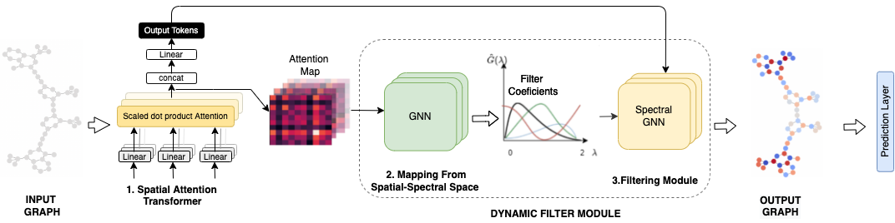

# How Expressive are Transformers in Spectral Domain for Graphs?

This repository implements the approach outlined in the paper "How Expressive are Transformers in Spectral Domain for Graphs?". 
Note: This is the code that was submitted for the review. For purposes of keeping information anonymous the code(variables, function names, comments etc.) may not be very understandable. We are in the process of cleaning the code and will push the changes post this. Please write back in case of any queries.

## Short Description about FeTA



FeTA is a module designed for learning transformations on the spectral components of graph structured data.

## Installation

Environment:
```
numpy=1.18.1
scipy=1.3.2
Cython=0.29.23
scikit-learn=0.22.1
matplotlib=3.4
networkx=2.5
python=3.7
pytorch=1.6
torch-geometric=1.7
rdkit-pypi=2021.03.3
dgl==0.6.1
```

To begin with, run:
```
cd FeTA
. s_env
```

To install GCKN, you also need to run:
```
make
```

You also need to create a cache folder to store computed positional encoding
```
mkdir -p cache/pe
```

## Training FeTA

To train FeTA on MUTAG, run:
```bash
python -m experiments.run_transformer_gengcn_cv --gnn_type='ChebConvDynamic' --seed=0 --dataset='MUTAG'
```

To train FeTA on NCI1, run:
```bash
python -m experiments.run_transformer_gckn_gengcn_cv --gnn_type='ChebConvDynamic' --seed=0 --dataset='NCI1'
```

To train FeTA on ZINC, run:
```bash
python -m experiments.run_transformer_gckn_gengcn --gnn_type='ChebConvDynamic' --seed=0 --dataset='ZINC'
```


To train FeTA on MolHIV, run:
```bash
python -m experiments.run_transformer_gengcn_molhiv --gnn_type='ChebConvDynamic' --batch-size=1024 --epochs=10
```


To train FeTA on PATTERN, run:
```bash
python -m experiments.run_transformer_gengcn_SBM_cv --gnn_type='ChebConvDynamic' --batch-size=64 --epochs=100 --dataset='PATTERN'
```


To train FeTA on CLUSTER, run:
```bash
python -m experiments.run_transformer_gengcn_SBM_cv --gnn_type='ChebConvDynamic' --batch-size=64 --epochs=100 --dataset='CLUSTER'
```

To run the optimized configurations of FeTA (along with the position encodings) the scripts are provided in the folder `scripts` under the respective dataset.

Here `--fold-idx` can be varied from 1 to 10 to train on a specified training fold. To test a selected model, just add the `--test` (this will use complete train + val data) flag.

Configurations from GraphiT paper:
To include Laplacian positional encoding into input node features, run:
```bash
python run_transformer_gengcn_cv.py --dataset NCI1 --gnn_type='ChebConvDynamic' --fold-idx 1 --pos-enc diffusion --beta 1.0 --lappe --lap-dim 8
```

To include GCKN path features into input node features, run:
```bash
python run_transformer_gckn_gengcn_cv.py --dataset NCI1 --gnn_type='ChebConvDynamic' --fold-idx 1 --pos-enc diffusion --beta 1.0 --gckn-path 5
```

#### Regression

To train FeTA on ZINC, run:
```bash
python run_transformer_gengcn.py --gnn_type='ChebConvDynamic' --pos-enc diffusion --beta 1.0
```

To include Laplacian positional encoding into input node features, run:
```bash
python run_transformer_gengcn.py --gnn_type='ChebConvDynamic' --pos-enc diffusion --beta 1.0 --lappe --lap-dim 8
```

To include GCKN path features into input node features, run:
```bash
python run_transformer_gckn_gengcn.py --gnn_type='ChebConvDynamic' --pos-enc diffusion --beta 1.0 --gckn-path 8
```


# Citation
If you use our work kindly consider citing

```
@article{
bastos2022how,
title={How Expressive are Transformers in Spectral Domain for Graphs?},
author={Anson Bastos and Abhishek Nadgeri and Kuldeep Singh and Hiroki Kanezashi and Toyotaro Suzumura and Isaiah Onando Mulang'},
journal={Transactions on Machine Learning Research},
year={2022},
url={https://openreview.net/forum?id=aRsLetumx1},
note={}
}
```

# Acknowledgements
The code has been adapted from [Graph Transformer](https://github.com/graphdeeplearning/graphtransformer), [GraphiT](https://github.com/inria-thoth/GraphiT) and [SAN](https://github.com/DevinKreuzer/SAN) repositories.